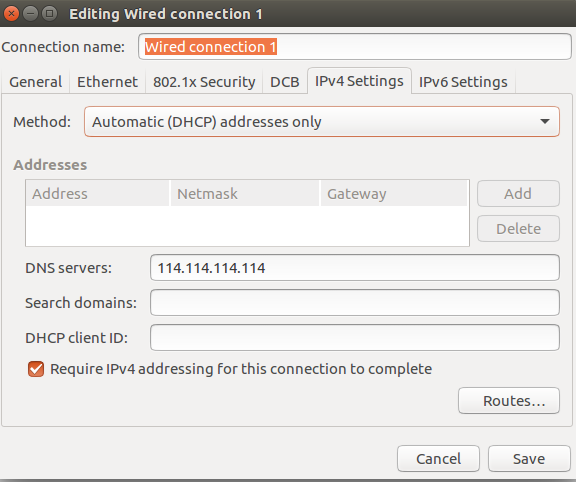

# Ubuntu 16装机过程
## 解决网络问题
### DNS Server
默认的DNS Server可能是无效的。 如果不能上网， 试试在network connection的IPV4 setting里面添加有效的DNS Server，如114.114.114.114, 并且把Method设置成Automatic(DHCP) address only



配置后需要运行'''sudo systemctl restart network-manager.service'''让设置生效

### 翻墙
shadowsocks安装和配置看[这里](https://github.com/shadowsocks/shadowsocks/wiki/Shadowsocks-%E4%BD%BF%E7%94%A8%E8%AF%B4%E6%98%8E
)

注意安装shadowsocks的时候，要用sudo安装
```
sudo to install shadowsocks
```

为了开机的时候能够自动启动ss，可以将

```sslocal -c /etc/shadowsocks.json -d start```

这一命令添加至

```/etc/rc.local```

这样每次开机就能自动启动sslocal。

启动了shadowsocks， 还得配置firefox， [见这里](https://aiguge.xyz/firefox-shadowsocks-foxyproxy-standard/)

gfwlist可以使用```https://aiguge.xyz/firefox-shadowsocks-foxyproxy-standard/```


## 升级ubuntu到较新的状态
```sudo apt-get dist-upgrade```

## python必备库安装
ubuntu 16自带了python3.5， 可以不需要自己安装

### 安装pip
```apt-get install python-pip```

### virtualenv
由于Ubuntu默认使用的python是2.7版本的,为了避免不必要的麻烦，可以使用virtualenv创造一个python3.5的环境。先安装virtualenv
```sudo apt-get install virtualenv```

然后创建虚拟环境，我将虚拟环境的文件夹放在了home下， 如果想放在别的地方请自己调整命令的参数。
```
virtualenv -p /usr/bin/python3.5 ~/venv
```

然后激活创建的virtualenv,新建一个teminal后，输入。
```
source ~/venv/bin/activate
```
可以看到terminal前面出现了一个(venv)字样，提示已经进入了虚拟环境。

这个命令太长，每次输入很麻烦。我们可以为这个命令创建一个简化的命令'venv'。在```~/.bash_aliases```文件中输入
```
alias venv='source ~/venv/bin/activate'
```
运行
```
source ~/bashrc
```
让刚才的设置生效。之后进入terminal后只要输入```venv```就可以进入我们的虚拟环境。

**之后安装python库的时候都是先进入```venv```虚拟环境后安装的，后面不在重复说明。


### cx_Oracle	
```sudo apt-get install unzip python3.5-dev libaio-dev```
[具体安装方式见](https://gist.github.com/kimus/10012910)

instantclient-basic-linux.x64-12.1.0.2.0.zip[下载](http://www.oracle.com/technetwork/topics/linuxx86-64soft-092277.html)

instantclient-sdk-linux.x64-12.1.0.2.0.zip[下载](http://www.oracle.com/technetwork/topics/linuxx86-64soft-092277.html)

### psycopg2
```sudo apt-get install python-psycopg2```

```pip install psycopg2```


## Postgresql-9.5安装
[见这里](https://www.postgresql.org/download/linux/ubuntu/)

### 添加数据库用户
postgreSQL会自动给ubuntu和数据库本身创建一个名为postgres的用户名。

首先修改postgres用户(ubuntu)的密码
```
sudo passwd postgres
```

切换到postgres用户(ubuntu)，登陆数据库
```
sudo su postgres
psql
```
然后建立一些普通的数据库用户，习惯上可以和ubunut的用户名保持一直。 注意这个账号如果要使用pl/python， 就必须得提供超级用户权限。

```
create user datascience superuser password 'xxxxxxx';
```

### 建立数据库
可以根据需要为该账号建立数据库。
```
create database etl;
alter database etl owner to datascience;
\q
```

之后如果要在非postgres用户状态下进入数据库

```
psql -U [dbuser] -d [db] -h 127.0.0.1 -p 5432
```

### plpython的安装
```
sudo apt-get install postgresql-plpython3
```
登陆想使用plpython3数据库后，运行
```
CREATE EXTENSION plpython3u;
```

如果要让plpython能够使用自己python库， 需要添加PYTHONPATH信息至etc/postgresql/9.5/main/environment, 如
```
PYTHONPATH='/home/cjj/jfds
```

## Wine
如果要在ubuntu运行一些window程序的话，需要这个
```
sudo apt-get update
sudo apt-get install wine
```
注意安装wine的界面要按tab才能切换到OK按钮


## Git安装
```sudo apt-get install git```


## 安装常用软件
### 搜狗拼音
先用
```
sudo apt-get install -f
```
修复一些包依赖的问题。

[download](http://pinyin.sogou.com/linux/help.php)很不错的中文输入法, 直接下载双击deb会失败，需要用```sudo dpkg -i xxx.deb```命令安装

如果出现了下面的提示

No such key 'Gtk/IMModule' in schema 'org.gnome.settings-daemon.plugins.xsettings' as specified in override file '/usr/share/glib-2.0/schemas/50_sogoupinyin.gschema.override'; ignoring override for this key.

并不用在意，这个不会影响搜狗输入法的使用。


### download them all
这个是firefox的插件， 可以有更好的下载体验

### okular
一个带笔记标注功能的pdf浏览器

### startuml2
很好的uml建模工具

[下载依赖库](https://launchpad.net/ubuntu/+archive/primary/+files/libgcrypt11_1.5.3-2ubuntu4.2_amd64.deb

```
sudo dpkg -i libgcrypt11_1.5.3-2ubuntu4.2_amd64.deb

```

```
sudo apt-get libpango1.0-0 libpangox-1.0-0
```

[官网](www.staruml.io)下载deb安装包安装
```
sudo dpkg -i StarUML-v2.7.0-64-bit.deb


```python

```
