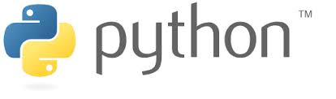

# 面向非程序员的Python编程-Part 1

## 熟悉基本的数据类型

### 整数int

表示一个整数很容易


```python
123
```


    123


对整数进行一些基本的运算


```python
100 + 100 - 200
```


    0


```python
print(1 + 1)
print(2 * 3)
print(2 ** 3) # 2的3次方
print(3 % 2) # 3除以2取余数
print(5 / 2)
print(5 // 2) # 做除法后保留整数
```

    2
    6
    8
    1
    2.5
    2


 运算优先级


```python
1 + 2 * 3
```


    7


善用()控制优先顺序


```python
1 + ((2 * 3) + (3 / 4))
```


    7.75


## 浮点数float

不同的创建方式


```python
print(1.0)
print(float(1))
```

    1.0
    1.0


float可以和int一起参与计算，结果会被处理成float


```python
1 + 4.3
```


    5.3


## 字符串

可以用单引号或者双引号表示字符串


```python
print('yademan')
print("yademan")
```

    yademan
    yademan


但是不能混合使用哦


```python
'yademan"
```


      File "<ipython-input-9-a13b6841177a>", line 1
        'yademan"
                 ^
    SyntaxError: EOL while scanning string literal


如果字符串的内容有单引号，那么可以用双引号去标记字符串；反之亦然


```python
print('my name is "yademan"')
print("my name is 'yademan'")
```

    my name is "yademan"
    my name is 'yademan'


如果字符串里面的内容同时有双引号和单引号，为了让python分清哪些引号是内容，哪些只是标记字符串，可以在表示内容的引号前加上\


```python
print('my name is \"yademan\'')
print("my name is \"yademan\'")
```

    my name is "yademan'
    my name is "yademan'


可以用 + 连接字符串


```python
'yademan' + '@wacai.com'
```


    'yademan@wacai.com'


猜猜下面的结果?


```python
'哈' * 20 + '!'*5
```


    '哈哈哈哈哈哈哈哈哈哈哈哈哈哈哈哈哈哈哈哈!!!!!'


### 定义大段的字符串

如果有一段较长的文本, 写成一行读起来会很费劲。


```python
'Python is an interpreted high-level programming language for general-purpose programming. Created by Guido van Rossum and first released in 1991, Python has a design philosophy that emphasizes code readability, notably using significant whitespace. It provides constructs that enable clear programming on both small and large scales.[25] In July 2018, Van Rossum stepped down as the leader in the language community after 30 years.'
```


    'Python is an interpreted high-level programming language for general-purpose programming. Created by Guido van Rossum and first released in 1991, Python has a design philosophy that emphasizes code readability, notably using significant whitespace. It provides constructs that enable clear programming on both small and large scales.[25] In July 2018, Van Rossum stepped down as the leader in the language community after 30 years.'


如果要分行定义字符串的话会报错


```python
'Python is an interpreted high-level programming language for general-purpose programming. 
Created by Guido van Rossum and first released in 1991, 
Python has a design philosophy that emphasizes code readability, 
notably using significant whitespace. 
It provides constructs that enable clear programming on both small and large scales.
[25] In July 2018, Van Rossum stepped down as the leader in the language community after 30 years.'
```


      File "<ipython-input-15-c8ed37c971e1>", line 1
        'Python is an interpreted high-level programming language for general-purpose programming.
                                                                                                   ^
    SyntaxError: EOL while scanning string literal


可以用`(...)`分行书写这样的长文本。注意行与行之间不能加空格。这段代码和上一段实现的功能一样。


```python
(
    'Python is an interpreted high-level programming language for general-purpose programming.'
    'Created by Guido van Rossum and first released in 1991, '
    'Python has a design philosophy that emphasizes code readability, '
    'notably using significant whitespace. '
    'It provides constructs that enable clear programming on both small and large scales.'
    "[25] In July 2018, Van Rossum stepped down as the leader in the language community after 30 years."
)
```


    'Python is an interpreted high-level programming language for general-purpose programming.Created by Guido van Rossum and first released in 1991, Python has a design philosophy that emphasizes code readability, notably using significant whitespace. It provides constructs that enable clear programming on both small and large scales.[25] In July 2018, Van Rossum stepped down as the leader in the language community after 30 years.'


用`'''...'''`也可以定义大段的文本, 注意使用这种方式， `'''...'''`中包含的空格，换行都会被保留


```python
print(
    '''
    Python is an interpreted high-level programming language for general-purpose programming. 
    
    Created by Guido van Rossum and first released in 1991, Python has a design philosophy that 
    
    emphasizes code readability, notably using significant whitespace. It provides constructs 
    
    that enable clear programming on both small and large scales.[25] In July 2018, Van Rossum 
    
    stepped down as the leader in the language community after 30 years.
    '''
)
```

    
        Python is an interpreted high-level programming language for general-purpose programming. 
        
        Created by Guido van Rossum and first released in 1991, Python has a design philosophy that 
        
        emphasizes code readability, notably using significant whitespace. It provides constructs 
        
        that enable clear programming on both small and large scales.[25] In July 2018, Van Rossum 
        
        stepped down as the leader in the language community after 30 years.
        


```python

'''
Python is an interpreted high-level programming language for general-purpose programming. 

Created by Guido van Rossum and first released in 1991, Python has a design philosophy that 

emphasizes code readability, notably using significant whitespace. It provides constructs 

that enable clear programming on both small and large scales.[25] In July 2018, Van Rossum 

stepped down as the leader in the language community after 30 years.
'''

```


    '\nPython is an interpreted high-level programming language for general-purpose programming. \n\nCreated by Guido van Rossum and first released in 1991, Python has a design philosophy that \n\nemphasizes code readability, notably using significant whitespace. It provides constructs \n\nthat enable clear programming on both small and large scales.[25] In July 2018, Van Rossum \n\nstepped down as the leader in the language community after 30 years.\n'


## 变量

先看下面这段表达式， 大家是否能一眼看出它的意图?


```python
 (((4 + 5 + 6)/2) * ((4 + 5 + 6)/2 - 4) * ((4 + 5 + 6)/2 - 5) * ((4 + 5 + 6)/2 - 6)) ** 0.5
```


    9.921567416492215


实际上上面的表达式的含义是根据三角形的三条边的边长4, 5, 6按照海伦公式计算面积。上面的表达式有很多不足

* 存在很多重复的计算，例如周长的一般(4 + 5 + 6) / 2 被重复计算了3遍
* 整个表达式非常复杂，读起来很费劲(可读性差)

这时候，可以利用编程语言都支持的“变量”这一工具改善这个问题

看下面引入变量的代码


```python
# 用变量a, b, c去指代4,5,6三个数据
a = 4
b = 5
c = 6

# 之后可以用变量去表达计算逻辑， 并且将结果存成其他的变量
half_perimeter = (a + b + c) / 2

surface = (half_perimeter * (half_perimeter - a) * (half_perimeter - b) * (half_perimeter - c)) ** 0.5
surface
```


    9.921567416492215


```python
part_a = half_perimeter - a
part_b = half_perimeter - b
part_c = half_perimeter - c


surface = (half_perimeter * part_a * part_b * part_c) ** 0.5
surface
```


    9.921567416492215


上面的代码中的a, b, c, half_perimeter, surface就是变量名， 它们让你有机会用一个更有意义的名字去指代数据或者中间计算结果，使用变量的好处
* 取一个更有意义的名字，让代码更容易理解
* 让重要的中间结果可以被保存，避免每次重新倒要重新计算， 例如用half_perimeter表示周长的一半
* 将复杂的运算逻辑拆分几个独立的步骤, 让每一步计算不是那么复杂难懂

如此之外，在变量的帮助下，可以清晰的隔离出代码中容易发生变化的成分和不容易发生变化的成分。

在用海伦公式计算三角形的面积这个需求中，三角形的边长是容易发生变化的，给定边长以后计算面积的逻辑是固定的。下面的代码清晰的分析出了这两部分。


```python
# 三角形的边长是容易改变的部分， 变量接收的是具体的数值
a = 4
b = 5
c = 6

# 给定边长后的计算逻辑是固定的，这里公式自带的常数，没有定死的数值
half_perimeter = (a + b + c) / 2

surface = (half_perimeter * (half_perimeter - a) * (half_perimeter - b) * (half_perimeter - c)) ** 0.5
```

如果我们的边长变成了7, 8, 9，我们可以放心的改变的边长的定义，不用去操心后面的计算逻辑


```python
# 边长变成7, 8, 9我们只需要改变开头的定义
a = 7
b = 8
c = 9

# 我们知道不管前面的部分怎么改，后面的逻辑不需要改变。也就不必操心这部分。
half_perimeter = (a + b + c) / 2

surface = (half_perimeter * (half_perimeter - a) * (half_perimeter - b) * (half_perimeter - c)) ** 0.5
```

对比一下， 如果没有做好“可变和不变”的分离，那么一旦需求发生改变，那么事情就会很麻烦。

例如如果代码是下面这样，虽然一定程度上利用变量拆分了复杂的计算过程，但是如果要把计算的边长替换成4,5,6，那么就要很小心的去阅读代码，将原先的2,3,4替换掉，同时要保留海伦公式自带的常数2。

这个过程这会消耗不少时间和精力，而且容易无意中改错代码，又需要额外的时间精力去排查和修正错误。


```python
# 并没有将需求中容易变化的边长和剩余的计算逻辑很好的分离，今后边长变化时就得去小心的阅读，理解和修改代码
part_a = (2 + 3 + 4) / 2 - 2
part_b = (2 + 3 + 4) / 2 - 3
part_c = (2 + 3 + 4) / 2 - 4

surface = (part_a * part_b * part_c) ** 0.5
```
