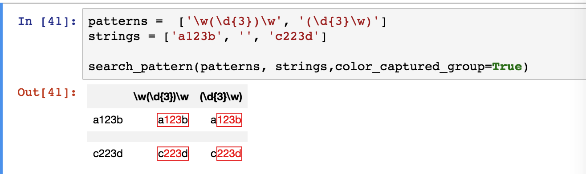

A library helping to visualize regular expression search result.

Search each string against each pattern in inputs, and organize the result as styled html table.

Matched string is red borderd and captured string is colored in red.

